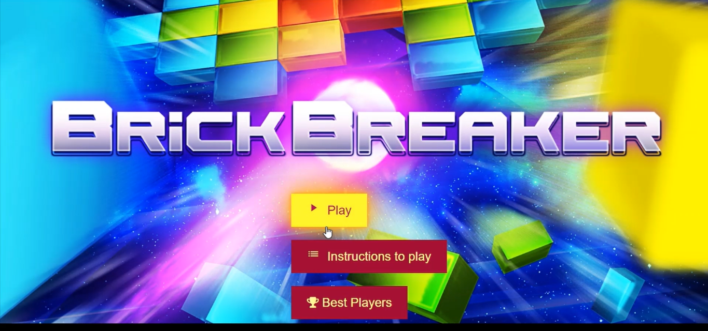
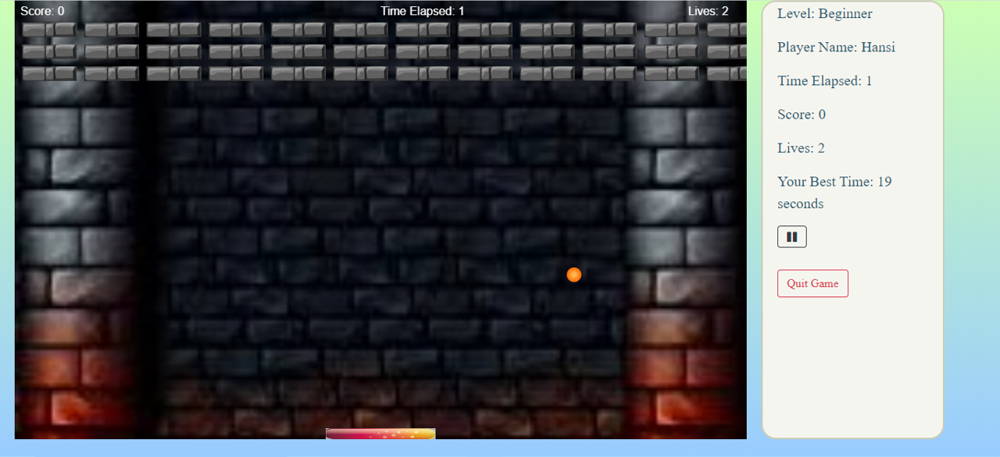
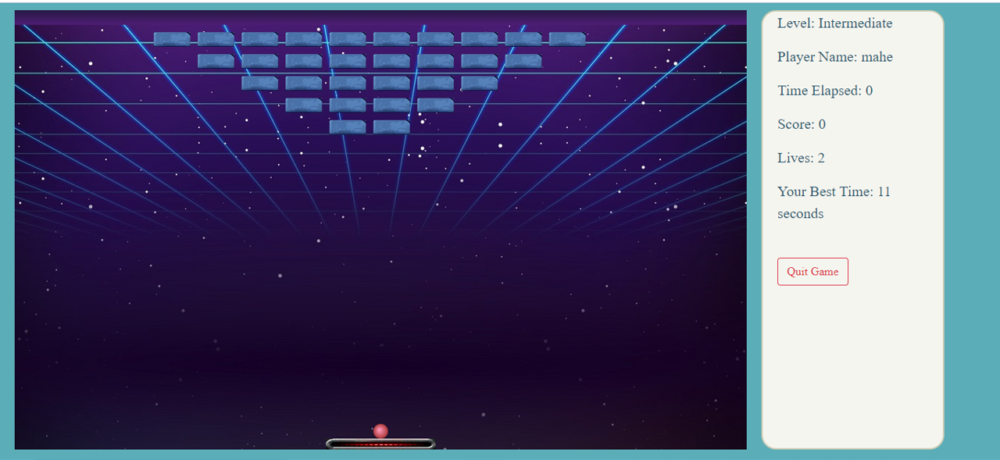
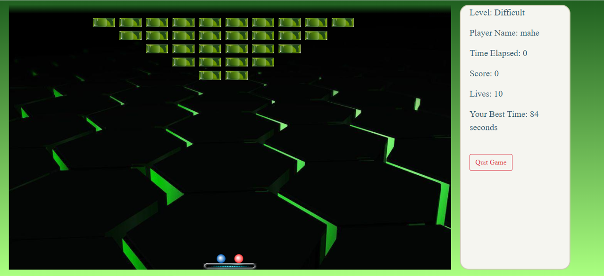
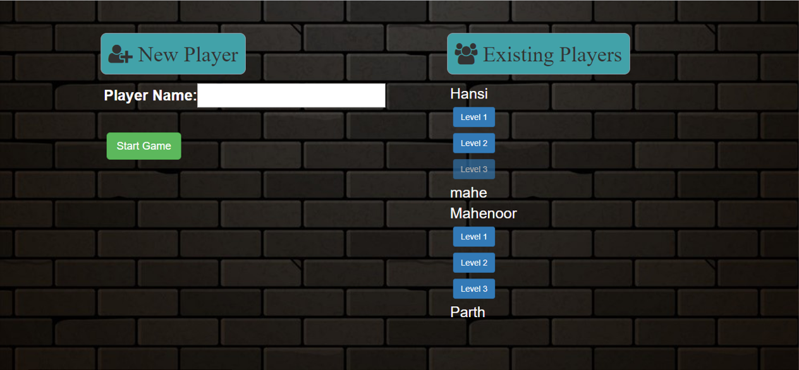
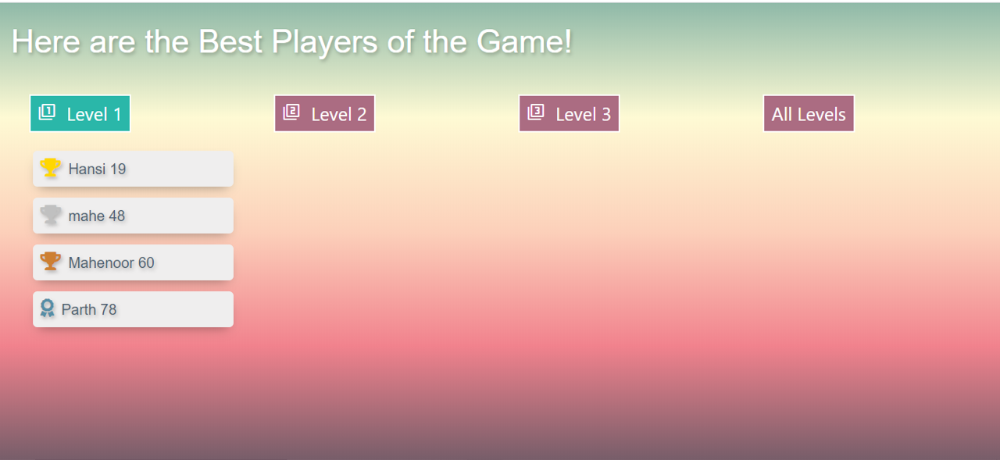

# Brick Breakout Game
#### Mini Project Semester 4

A web-based game with three levels of difficulty. User can enter their name to keep a 
record of all the players and their scores. The website also displays the players for each 
level as well as for the overall game. Next level is accessible only if the player has 
completed the previous level. Players can replay any number of times.

Technologies Used: 

## Some Screenshots:
### Homepage

### Level 1

### Level 2

### Level 3

### All Players

### Best Players

